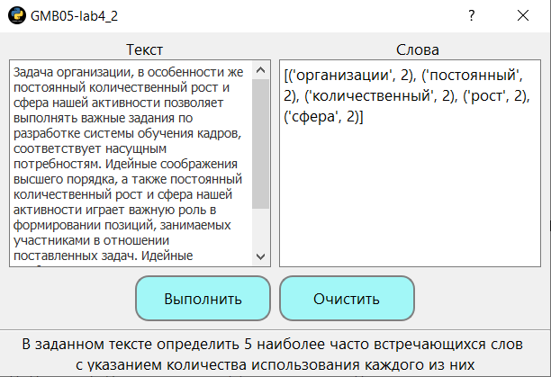

# GMB05_lab4_2_Python
Practical work 4_2. In the discipline of Cross-platform Application Development. In a given text, identify the 5 most common words with an indication of the amount of use of each of them



## Код реализации алгоритма ##
```
def solve(self):
    self.textEdit_words.clear()
    txt = self.textEdit_text.toPlainText()  # получаем наш текст
    cnt = Counter(x for x in re.findall(r'[a-zA-Zа-яА-ЯёЁ\']{2,}', txt))
    self.textEdit_words.setText(str(cnt.most_common(5)))
```

Teacher: https://github.com/proffix4
